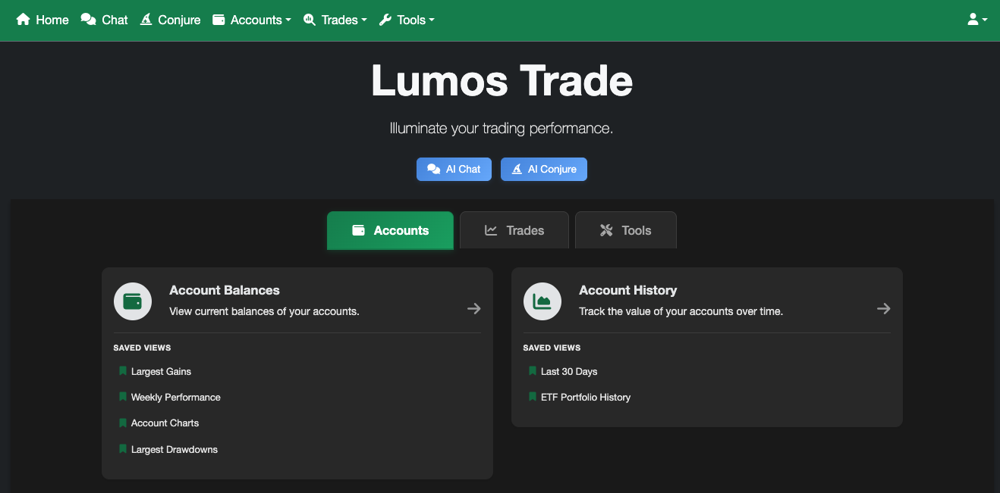
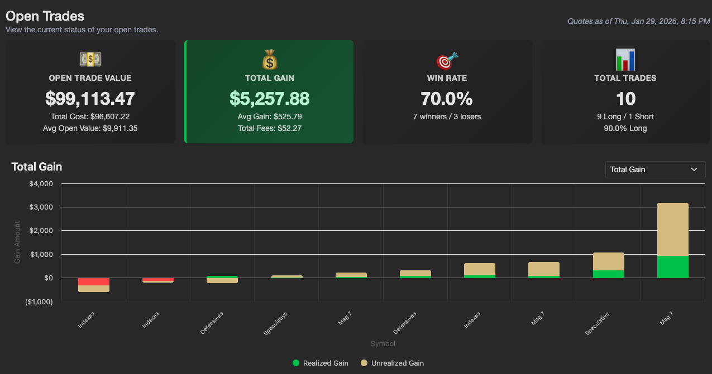
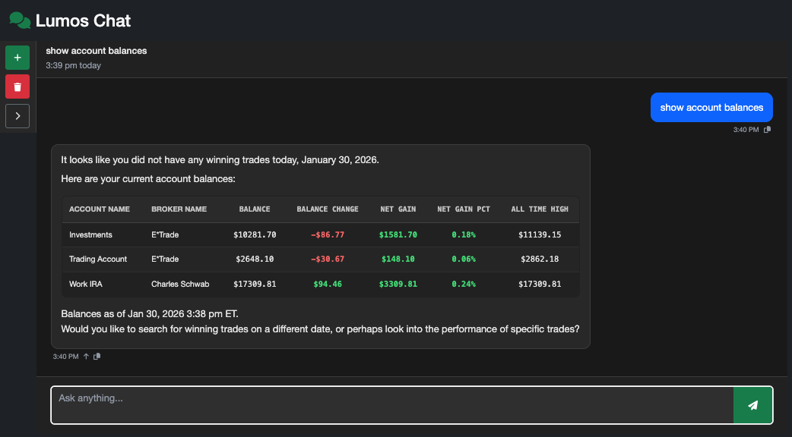
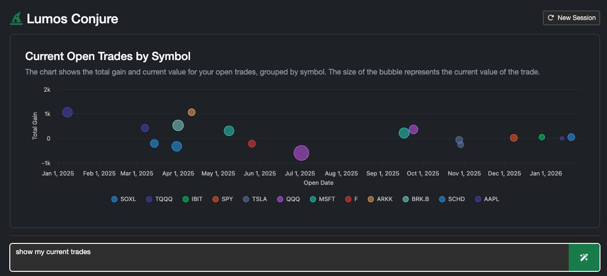
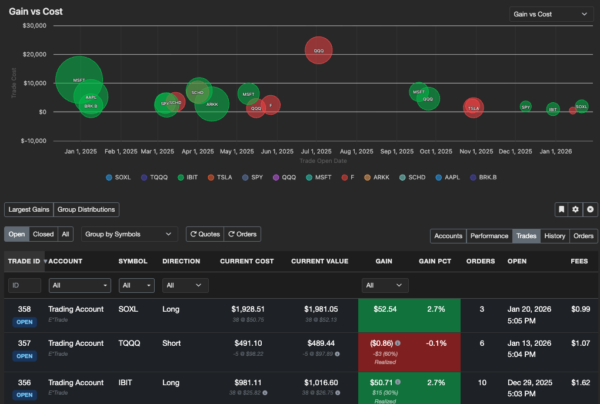
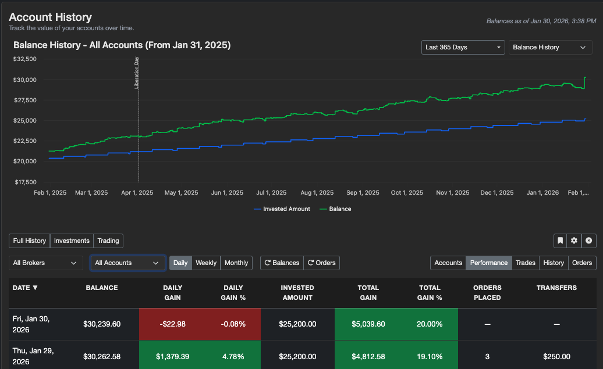
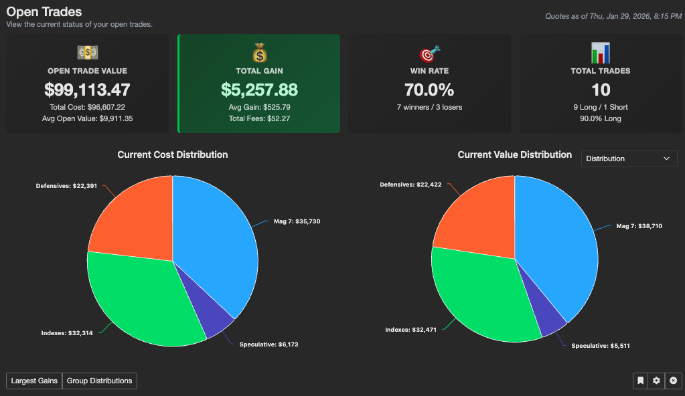

# Lumos Trade

  

Lumos Trade is an open source trade visualization and analysis platform used to explore account performance, trades, and portfolio history, with AI-assisted workflows for questions and reporting. Lumos Trade runs as a self-hosted single-tenant application on Google Cloud.

  

  
  
  

  
  
  

## What you can do with Lumos

- **Analyze performance across brokers**: report on trade and account performance over time across multiple brokers (ETrade and Charles Schwab to start) all in one centralized location.
- **Deep trade analytics**: track scale-in/scale-out performance, break-even and average costs, reward/risk ratios, and rollups by day, week, or month for longer-term trend clarity.
- **Portfolio context**: measure gains relative to invested capital as you deposit or withdraw funds, and group holdings into reporting categories (for example, Tech, Metals, Defensives) to compare strategy performance.
- **Tools for decisions and execution**: calculate expected moves on daily/weekly/monthly horizons and automate recurring extended-hours trades (7am–8pm) for systematic entry and exit.
- **AI-assisted workflows**: ask questions about your trades and accounts with LumosChat, and generate charts/tables with LumosConjure for faster exploration and reporting.

> ⚠️ *This project is in active development and should be treated as a beta. Use at your own risk.*

## Overview Video

See also the [Project Overview](docs/OVERVIEW.md)

## More Lumos Trade Videos!

- [AI Services Demo](docs/AI_SERVICES.md)
- [Installing Lumos](docs/INSTALLATION.md)
- [Architecture Oveview](docs/ARCHITECTURE.md)

Check out the [Full Playlist](https://youtube.com/playlist?list=PLFIgJytZ9IRceh-fO-vsr0ZJqcekVVryz&si=DP__y0EJTuuvaIMu) on youtube.

## Live Demo
Try out Lumos Trade with simulated data:

  <a href="https://lumos-app-210429327960.us-east4.run.app/" target="_blank" rel="noopener" style="display:inline-block;padding:12px 20px;border-radius:8px;background:#16a34a;color:white;text-decoration:none;font-weight:600;">
    Launch Demo
  </a>

Password: demo

*Warning: You may hit quota/resource limits in the AI agent tools. If you do, just try again later or watch the [video](https://youtu.be/XrKq4WUwWXA?si=RcNziSLh0r_YYEmX). This stuff costs money!*

---

## More Information

- [Installing Lumos](docs/INSTALLATION.md)
- Operations and environments: [docs/OPERATIONS.md](docs/OPERATIONS.md)
- Secret management: [config/SECRET_MANAGEMENT.md](config/SECRET_MANAGEMENT.md)

## License and Legal

---

**🔴 IMPORTANT: By using this software, you agree to the terms in [DISCLAIMER.md](DISCLAIMER.md) and [LICENSE](LICENSE). This software is for educational purposes only and is provided "AS IS" without warranties of any kind. Trading involves substantial risk of loss.**

Lumos Trade is licensed under the **Apache License 2.0** - see [LICENSE](LICENSE) for full details.

**Key Points:**
- ✅ Free to use, modify, and distribute
- ✅ Can be used commercially
- ✅ Patent grant included
- ⚠️ Must preserve copyright notices
- ⚠️ Must state significant changes
- ⚠️ Provided "AS IS" with NO WARRANTIES

**Third-Party Dependencies:** This project uses open source software from Google (Cloud SQL Connector, ADK, Vertex AI), Node.js ecosystem, and other libraries. Each dependency has its own license - see package.json files and dependency documentation.

**CRITICAL DISCLAIMER:** You **MUST** read and understand the complete [DISCLAIMER](DISCLAIMER.md) before using this software. Trading involves substantial risk of loss. 

## About Lumos Trade

Every line of code and word of documentation you see was written by AI tools (Github Copilot driving Claude Sonnet 4.5, GPT 5.2 Codex, Gemini 3 Pro, and Raptor Mini) over a highly productive 3 month marathon vibe collaboration with Mark Isham. Not a single if-else was written by hand!

Primary goals:

1. Gain deep experience using AI tools to build clean, reusable, scalable, production-grade software. Prove to myself that AI tools don't just create unmaintainable "slop".
2. Get hands-on experience building AI Agents (ADK) and MCP tools and learn the ecosystem.
3. Solve real-world frustrations and inefficiencies I was facing with existing stock broker tools and reports.

*Conclusion: Software engineering has fundamentally changed and I'm never going back. These AI models took all the toil out of development and greatly expanded my ambition of what was possible. I would have never coded some of the tools you see in Lumos if I was writing them myself. With great power comes great...scope creep.*

Feel free to download, contribute and ask questions. I hope you find value in this project and dare to expand it...using AI of course!

**Copyright © 2025-2026 Mark Isham**

*Lumos Trade was created by [Mark Isham](https://www.linkedin.com/in/mtisham/), contact: [mtisham@gmail.com](mailto:mtisham@gmail.com)*

