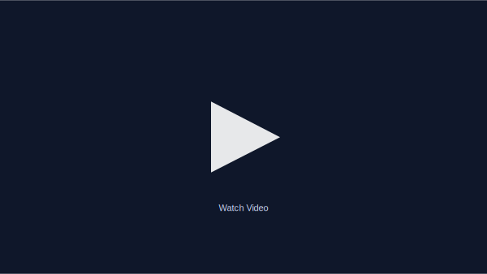

# Installation Guide

## Video Walkthrough

**[Watch the full installation video on YouTube](https://www.youtube.com/watch?v=Eo4p4EaQz8c)**

# Lumos Trade Installation Guide

To ensure a smooth and secure setup, it is **highly recommended to use the provided automated install script** rather than attempting to run these steps manually. The script is "rerunnable," meaning if it fails or is interrupted, you can simply run it again to pick up where it left off.

### Phase 1: Google Cloud Platform (GCP) Preparation
1.  **Create a New Project:** Log in to Google Cloud and create a dedicated project for Lumos. This keeps permissions clean and makes it easier to manage.
2.  **Initialize Environment:** In your terminal, run the Lumos shell script to create an environment. You will select your project, region, and provide an environment name.

### Phase 2: Running the Automated Installer
Run `./lumos install`. The script will automate the following:
1.  **Enable APIs:** It automatically enables all necessary Google Cloud APIs, such as Cloud Run, Secret Manager, and Cloud Build.
2.  **Cloud SQL (MySQL) Setup:** The script creates a MySQL 8.4 instance. 
    * **Note:** This is the longest step and can take 15–20 minutes.
3.  **Database Configuration:** Once the instance is ready, the script creates the `Lumos` database, sets up a user, and initializes the schema.
4.  **Data Store:** It initializes a Firestore/Data Store database to hold UI settings and access tokens.

### Phase 3: Security & Service Accounts
1.  **Secret Manager:** The script generates a secrets file. You should choose the option to **upload secrets to Google Secret Manager** and then delete the local file for security.
2.  **Service Accounts:** The script creates three specific service accounts (App, Agent, and Tool) with "least privilege" permissions to ensure system security.

### Phase 4: Deployment & Automation
1.  **Cloud Run Deployment:** The script uses Cloud Build to create Docker images and deploy the four core services to Cloud Run. This typically takes 5–15 minutes.
2.  **Cron Jobs:** The script sets up a "Refresh" job in Cloud Scheduler to automatically pull balance and trade info from your broker daily.

### Phase 5: Broker Integration
1.  **Access the Web App:** Open the URL provided by the script and log in using the `LUMOS_APP_AUTH` password found in your secrets.
2.  **Link Broker APIs:** Enter your E*Trade or Schwab API keys in the settings page. 
    * **Important for Schwab:** You must register the specific callback URLs provided in the Lumos settings within the Schwab developer portal.
3.  **Finalize Secrets:** After entering your keys in the UI, run the `secrets upload` command in your terminal to save them securely to GCP.
3.  **Authorize:** Visit the LunosTrade URL, authorize your broker(s), then run the initial import. You're ready to go!

**Full Video Tutorial:** https://www.youtube.com/watch?v=Eo4p4EaQz8c